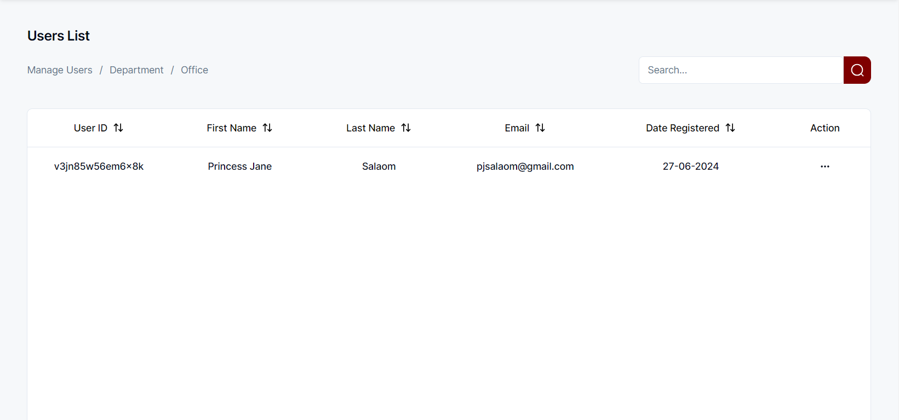
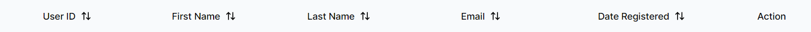
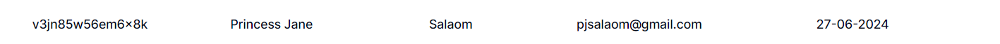
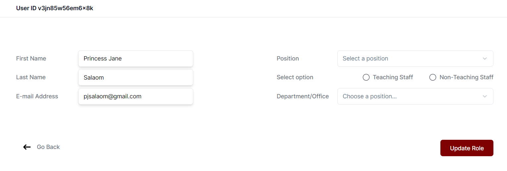

## Navigation:

To manage users, navigate to: http://localhost:3000/admin/users/manage-users

## File structure

#### File: [/app/admin/users/manage-users](/app/admin/users/manage-users/page.tsx)

This directory contains the main page for managing users. The page is defined in `page.tsx`.

#### File: [admin/users/manage-users/columns.tsx](/app/admin/users/manage-users/columns.tsx)

This file defines the columns configuration for the data table used on the manage users page.

#### File: [admin/users/manage-users/data-table.tsx](/app/admin/users/manage-users/data-table.tsx)

This file contains the data table component, which displays the list of users.

#### File: [admin/users/manage-users/manage/[id]](/app/admin/users/manage-users/manage/[id]/page.tsx)

This directory contains the page for managing a specific user, identified by their ID. The page is defined in `page.tsx`.

## Similar Forms

The forms for managing departments and offices are similar to the manage users form described above. They follow the same structure and are located in the corresponding directories under `admin/users`.